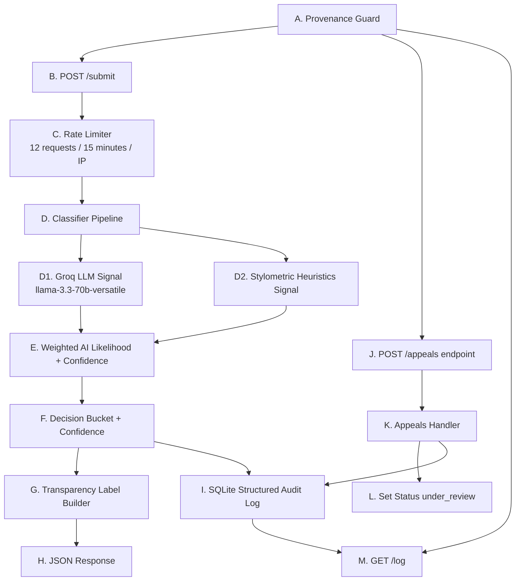

# Provenance Guard Planning

## Problem Statement

Creative platforms where people share original work — writing, music, and art, for example — are facing a new challenge: how do you know whether what someone posted was made by them, or generated by AI and passed off as human? A fair, transparent way to estimate whether submitted text is AI-generated or human-written is needed, while giving creators the ability to appeal a decision when the estimate is disputed.

## Scope
- Build a text attribution API.
- Use a multi-signal pipeline.
- Return confidence and user-facing transparency label.
- Capture immutable audit events.
- Support appeals that move content to under_review.
- Add submission rate limiting.

## Implementation Stack
- Python 3 with Flask for REST endpoints.
- Flask-Limiter for submission rate limiting.
- Groq API (`llama-3.3-70b-versatile`) as semantic attribution signal.
- Pure Python stylometric heuristics as second attribution signal.
- SQLite (`sqlite3`) for content, decisions, appeals, and audit events.

## Detection Signal Design
### 1. Groq semantic attribution signal:
  - Prompts `llama-3.3-70b-versatile` to return `ai_likelihood` in `[0, 1]`.
  - In that score:
    - 0 means very likely human-written.
    - 1 means very likely AI-generated.
    - Values in between represent uncertainty on a continuous scale.
  - Rationale: language model can evaluate context-level indicators not captured by simple heuristics.
### 2. Stylometric heuristics signal:
  - Combines lexical diversity risk and sentence burstiness risk.
    - **Lexical diversity risk** : 
      - Measures how repetitive the vocabulary is.
      - If a text reuses the same words a lot, diversity is low, so risk goes up.
      - If a text uses a wider variety of words, diversity is high, so risk goes down.
  - Rationale: generated text often has lower lexical variation and flatter sentence rhythm.
   - **Sentence burstiness risk**
      - Measures how much sentence lengths vary.
      - Human writing often has a mix of short and long sentences (more bursty).
      - Very uniform sentence lengths can look more machine-like, so risk goes up.
  - **“Combines … risk” means:**
      - You compute both risks on a 0 to 1 scale.
      - Then you take a weighted average to form one stylometric AI-likelihood component.

I chose the stylometric weights as 0.55 for lexical diversity risk and 0.45 for sentence burstiness risk because lexical diversity is usually a slightly more stable indicator across short and medium-length texts, while burstiness is valuable but more sensitive to genre and formatting. The near-balanced split keeps both signals influential, avoids over-reliance on a single heuristic, and supports a conservative scoring design that reduces overconfident false-positive AI labels.

### 3. Ensemble weighting:
  - Groq signal weight: 0.65
  - Stylometric signal weight: 0.35
  - If Groq is unavailable, fallback forces conservative `uncertain` decision.

I weighted Groq at 0.65 and stylometric heuristics at 0.35 because they play different roles in reliability and coverage:

### Groq signal (0.65) gets majority weight
  - It captures semantic and discourse-level cues that simple surface metrics cannot.
  - It can evaluate broader context, tone consistency, and high-level structure in a single pass.
  - In practice, this makes it the stronger primary signal when available.
  
### Stylometric signal (0.35) remains substantial
It is deterministic, local, and cheap to compute.
It provides an independent cross-check against model output.
It can still contribute meaningfully, especially when Groq is borderline.

## Uncertainty Representation, Confidence and Decision Rules

- aiLikelihood is a continuous score in the range [0,1].
  - 0.0 means very likely human-written.
  - 1.0 means very likely AI-generated.
  - Values near 0.5 represent ambiguity, so they are typically treated as uncertain.
- Signal fusion for aiLikelihood:
  - If Groq is available: `aiLikelihood = clamp(0.65 * groq + 0.35 * stylometric)`
  - If Groq is unavailable: `aiLikelihood = clamp(1.0 * stylometric)` and the system later forces uncertain as a safety guardrail.
- Confidence is calculated from both decisiveness and cross-signal agreement:
  - `distance_from_mid = abs(aiLikelihood - 0.5) * 2`
  - `agreement = 1 - abs(groq_ai_likelihood - stylometric_ai_likelihood)`
  - `confidence = clamp(0.35 + 0.45 * distance_from_mid + 0.20 * agreement)`
  - If Groq is unavailable, confidence is down-weighted by 25 percent and the result is forced to `uncertain`.
- Final decision buckets:
  - likely_ai when `aiLikelihood >= 0.86` and `confidence >= 0.75` and Groq is available
  - likely_human when `aiLikelihood <= 0.30` and `confidence >= 0.70`
  - uncertain otherwise
- Interpretation examples:
  - Around `aiLikelihood = 0.10` with strong confidence: likely_human
  - Around `aiLikelihood = 0.50`: uncertain by design
  - Around `aiLikelihood = 0.92` with strong confidence and Groq available: likely_ai
- Valid decisions statuses:  final, under_review 

## Transparency Label Design

Write these exact label variants before UI implementation:

1. High-confidence AI result:
"Transparency Notice: This content is likely AI-generated (high confidence: {{confidence}}%). If this is incorrect, the creator can submit an appeal for human review."

2. High-confidence human result:
"Transparency Notice: This content is likely human-written (high confidence: {{confidence}}%). If new evidence appears, this decision can still be re-reviewed."

3. Uncertain result:
"Transparency Notice: We could not confidently determine whether this content is AI-generated or human-written (current confidence: {{confidence}}%). No enforcement action is taken while the decision is uncertain."

### Label Specs
- Placeholder behavior:
  - `{{confidence}}` is replaced with a rounded whole-number percent from the confidence score in `[0, 1]`.
  - Example: `0.742` becomes `74%`.
- Mapping rule:
  - `result = likely_ai` -> use High-confidence AI label.
  - `result = likely_human` -> use High-confidence human label.
  - `result = uncertain` -> use Uncertain label.
- Display rule:
  - Exactly one label is returned in every `POST/submit` response.
  - Label text is also stored with the decision record for auditability.
- Tone and policy rule:
  - Labels must stay probabilistic ("likely", not absolute claims).
  - Uncertain label must explicitly state that no enforcement action is taken.
- Appeals hint:
  - AI label includes direct appeal guidance for creator recourse.

## Appeals Workflow
- Creator submits reasoning tied to a contentId.
- Appeal is persisted and linked to the latest decision.
- Content and decision status change to under_review.
- Appeal action is appended to structured audit log.
- Valid appeals.status values: under_review, resolved, rejected
- TODO: Refactor the rest of the project to use `creator_reasoning` consistently for appeal payloads, storage fields, and related documentation.
- Refactor checklist:
  - `src/app.py`: keep the active appeals handler on `creator_reasoning` and update the commented legacy example block so it no longer documents `reasoning`.
  - `src/store/audit_store.py`: rename the `save_appeal(..., reasoning: str)` parameter and returned payload keys to `creator_reasoning`.
  - `src/store/schema.sql`: rename the `appeals.reasoning` column to `creator_reasoning` if the schema contract is being updated at the database layer too.
  - `artifacts/provenance_guard_dump.sql`: update example schema and seeded audit payloads so snapshots match the new field name.
  - `planning.md`: replace the remaining appeal payload examples and schema field references that still say `reasoning`.

## Anticipated Edge Cases
- A poem or song lyric with heavy repetition and intentionally simple vocabulary may look machine-like to stylometric heuristics and get a higher AI-risk score.
- Very short submissions (for example, one sentence or a title-only post) provide too little signal for reliable attribution and may be forced into uncertain.
- Highly edited human writing that is intentionally formal and template-driven (such as scholarship statements) can resemble LLM style and trigger false positives.
- Hybrid drafts where AI generated a base and a human heavily revised it can produce mixed cues, reducing confidence calibration reliability.

## Rate Limit Plan
- Protect POST /submit with 12 submissions per IP per 15 minutes.
- Reasoning:
  - Normal creators rarely need more than a dozen attribution checks in 15 minutes.
  - This slows brute-force probing and flood attempts while preserving legitimate use.

## Audit Log Plan
- Log classification and appeal events in SQLite with:
  - event type
  - ids (content, decision, appeal)
  - timestamp
  - structured payload (signals, confidence, result, label text, appeal reason)

## API Surface
### 1. **POST/submit** -> signal 1 -> signal 2 -> confidence scoring -> transparency label -> audit log -> response
### 2. **POST/appeals** -> status update -> audit log -> response
### 3. **GET/log** -> entries: get_audit_log()

## Architecture

------------------------------------------------------------------------------
I tried to update the arrows on Mermaid, but was ultimately unsuccessful in doing so.

### Data Sent Per Flow Step:
  **A[A. Provenance Guard] --> B[B. POST /submit]**: {creatorId: creator-42, content: text to analyze}
  **B[B. POST /submit] --> C[C. Rate Limiter\n12 requests / 15 minutes / IP]**: Client identity key (typically IP address), Route key (POST /submit), Current timestamp/request count context 
**C[C. Rate Limiter] --> D[D. Classifier Pipeline]**: Sends one of two outcomes: 1. Allowed request (passes through) or 2. Blocked request (429 Too Many Requests).
**D[D. Classifier Pipeline] --> D1[D1. Groq LLM Signal\nllama-3.3-70b-versatile]**:
The submitted content text. A system instruction to score conservatively (to reduce false-positive AI accusations). A user instruction asking for JSON output with: ai_likelihood in the range [0, 1], rationale text
**D[D. Classifier Pipeline] --> D2[D2. Stylometric Heuristics Signal]**: same information that was sent to D1 Groq LLM signal
**D1[D1. Groq LLM Signal\nllama-3.3-70b-versatile] --> E[E. Weighted AI Likelihood + Confidence]**: ai_likelihood (0 = likely human, 1 = likely AI), rationale (brief explanation), availability/error fallback data if the call fails 
**D2[D2. Stylometric Heuristics Signal] --> E[E. Weighted AI Likelihood + Confidence]**: Combined stylometric AI-likelihood score in [0, 1] based on lexical diversity risk and sentence burstiness risk.
  **E[E. Weighted AI Likelihood + Confidence] --> F[F. "Decision Bucket + Confidence"]**: 
  1. aiLikelihood (0 to 1)
  2. Combined score after weighting Groq + stylometric signals.
  **F[F. "Decision Bucket + Confidence"] --> G[G. Transparency Label Builder]**: Uses those two values to assign likely_ai, likely_human, or uncertain and sends them to Transparency Label Builder.
  **G[G. Transparency Label Builder] --> H[H. JSON Response]** : transparencyLabel (human-readable sentence with confidence percent filled in)
**F[F. "Decision Bucket + Confidence"] --> I[I. SQLite Structured Audit Log]**: A full auditable classification event is written to SQLite: 1. Decision Outcome: result (likely_ai, likely_human, or uncertain), confidence, ai_likelihood, 2. Content Identifiers: contentId, decisionId, timestamp/event type 3. Evidence and output: signals used, labelText (transparencyLabel)
**A[A. Providence Guard] --> J[J. POST/appeals]**:  Payload: {"contentId": "20d2d201-e5ba-4eec-9ca1-712e6330180e", "creatorId":  "creator-1", "reasoning": "This draft came from my notebook revisions and timestamped edits."}
**J[J. POST/appeals] --> K[K. Appeals Handler]**: sends validated appeal payload to Appeals Handler. Payload is the same as A -> J. Payload: {"contentId": "20d2d201-e5ba-4eec-9ca1-712e6330180e", "creatorId":  "creator-1", "reasoning": "This draft came from my notebook revisions and timestamped edits."}
*** K[K. Appeals Handler] --> L[L. Set Status under_review]***: K sends a status change instruction to L: 1. target record IDs (contentId, and decisionId if present), 2. new status value: under_review, 3. update timestamp/context for persistence and audit.
*** K[K. Appeals Handler] --> I[I. SQLite Structured Audit Log]***: K (Appeals Handler) sends an appeal audit event to I (SQLite Structured Audit Log). It logs: 1. eventType: appeal_submitted, 2. IDs: contentId, decisionId (if available), appealId, 3. timestamp; 4. payload fields such as: creatorId, reasoning, updatedContentStatus = under_review
**A[A. Providence Guard] --> M[M. GET/log]**: A sends a read request to M, including an HTTP GET/log, no JSON body, for the purpose of asking the system the structured audit history. See audit payload in next entry. 
**I[I. SQLite Structured Audit Log] --> M[M. GET/log response handler]**: Audit Payload: eventType: classification_decision, contentId, decisionId, timestamp,  Decision Outputs: result (likely_ai, likely_human, uncertain), confidence, Signal Evidence: Groq signal, stylometric signal, and weights, Transparency Label: label text

## Data Persistence

**1. Create SQLite schema on app startup** 
- Initialize database file at SQLITE_DB_PATH.
- Create tables if they do not exist.

**2. Create contents table** 
Fields: content_id, creator_id, content, status, created_at, updated_at, latest_decision_id.

**3. Create decisions table**
Fields: decision_id, content_id, result, confidence, ai_likelihood, signals_json, label_text, status, created_at.

**4. Create appeals table** 
Fields: appeal_id, content_id, decision_id, creator_id, reasoning, status, created_at.

**5. Create audit_events table**
Fields: event_id, event_type, content_id, decision_id, appeal_id, timestamp, payload_json.

**6. Add integrity constraints**
- Check constraints for valid statuses/results.
- Numeric bounds for confidence and ai_likelihood in [0, 1].
- Foreign keys where appropriate.

**7. Add performance indexes** 
- Index by content_id, decision_id, appeal_id, event_type, and timestamp.

**8. Validate schema in final test pass**
- Confirm all 4 tables are created.
- Confirm submit writes contents, decisions, audit_events.
- Confirm appeal writes appeals and audit_events and updates status.

**9. Add foreign keys**
A. decisions.content_id -> contents.content_id
- Every decision must belong to an existing content submission.
- Use ON DELETE CASCADE (if content is removed, its decisions are removed too).

B. appeals.content_id -> contents.content_id
- Every appeal must reference existing content.
- Use ON DELETE CASCADE (if content is removed, its appeals are removed too).

C. appeals.decision_id -> decisions.decision_id (nullable)
- Appeals are typically tied to a specific decision.
- Keep nullable in case you ever allow appeals before a stored decision exists.
- Use ON DELETE SET NULL (safer than cascade here).

D. contents.latest_decision_id -> decisions.decision_id (nullable)
- Tracks the current/latest decision pointer on content.
- Use ON DELETE SET NULL.

E. audit_events.content_id -> contents.content_id 
- Keeps event log tied to real content rows.
- Provides strict integrity.

F. audit_events.decision_id -> decisions.decision_id (optional, nullable)
- Keeps event decision tied to real decision rows.
- Provides strict integrity.

G. audit_events.appeal_id -> appeals.appeal_id (optional, nullable)

## SQLite Persistence and Integrity Plan
Provenance Guard persists all records to SQLite using a centralized schema file: schema.sql. On startup, audit_store.py calls initialize_store(), which loads and executes that SQL script. The schema defines:

contents: submission records and current status
decisions: attribution outputs (result, confidence, ai_likelihood, signals_json, label_text)
appeals: creator disputes and review status
audit_events: immutable structured log entries for both classification and appeal actions
Integrity rules include:

CHECK constraints for valid statuses/results and score bounds in [0,1]
Foreign keys linking decisions, appeals, and audit events to parent records
ON DELETE behaviors (CASCADE / SET NULL) to preserve consistency
Performance support includes indexes on:

contents.creator_id
decisions.content_id
appeals.content_id
audit_events.content_id, audit_events.event_type, audit_events.timestamp

------------------------------------------------------------------------------------

## AI Tool Plan

### M3: Submission Endpoint + First Signal
- Spec sections I will provide to the AI tool:
  - Detection Signal Design
  - Architecture diagram
  - API Surface for POST /submit
- What I will ask it to generate:
  - Flask app skeleton with route scaffolding
  - Submission endpoint with payload validation for creatorId and content
  - First signal function (Groq semantic attribution) that returns aiLikelihood in [0,1]
  - Basic JSON response shape for classification output
- How I will verify:
  - Run the first signal function directly on several sample inputs before endpoint wiring
  - Confirm aiLikelihood is always bounded in [0,1]
  - Confirm response shape includes expected fields
  - Smoke test endpoint success and validation failures

### M4: Second Signal + Confidence Scoring
- Spec sections I will provide to the AI tool:
  - Detection Signal Design
  - Uncertainty Reprentation, Confidence and Decision Rules
  - Architecture diagram
- What I will ask it to generate:
  - Second signal function (stylometric heuristics: lexical diversity risk + sentence burstiness risk)
  - Weighted fusion logic for first and second signals
  - Confidence calculation logic and decision bucket mapping
  - Structured signal payload suitable for audit logging
- What I will check:
  - Scores vary meaningfully between clearly AI-like and clearly human-like text
  - Ambiguous samples trend near aiLikelihood ~ 0.5
  - Decision boundaries match plan thresholds
  - Groq-unavailable fallback produces conservative uncertain outcomes

### M5: Production Layer
- Spec sections I will provide to the AI tool:
  - Transparency Label Design (including exact label variants)
  - Appeals Workflow
  - Architecture diagram
- What I will ask it to generate:
  - Label generation logic mapping result bucket to exact label text with confidence substitution
  - Appeal endpoint with payload validation
  - Status transition logic to move content and decision to under_review
  - Audit event creation for appeal submission actions
- How I will verify:
  - Confirm all three label variants are reachable in tests
  - Confirm confidence values render correctly in label text
  - Submit an appeal and verify status changes to under_review
  - Verify audit log contains the appeal event with expected IDs and payload fields

  -------------------------------------------------------------------------------------------------------------------------

## Implementation Checklist

### 1. app.py
- Define routes: GET /health, POST /submit, POST /appeals, GET /log, optional GET /content/<content_id>.
- Add input validation for submit/appeal payloads.
- Wire rate limiter onto POST /submit.
- Return structured JSON responses and status codes (201, 400, 404, 429).

### 2. Centralize configuration in config.py
- Load .env values (PORT, RATE_LIMIT_SUBMIT, GROQ_API_KEY, GROQ_MODEL, GROQ_API_URL, SQLITE_DB_PATH).
- Keep defaults in code and read overrides from .env.

### 3. Implement Groq signal client in groq_client.py
- Send content to llama-3.3-70b-versatile.
- Prompt model to return JSON with ai_likelihood and rationale.
- Parse response robustly and clamp likelihood to [0,1].
- Add graceful fallback output when API key/network/model fails.

### 4. Implement stylometric signal + ensemble in classifier.py
- Implement stylometric calculations:
    - Compute lexical diversity risk
    - Compute sentence burstiness risk
    - Combine stylometric sub-signals. (0.55/0.45)
- Combine Groq + stylometric scores (0.65/0.35).
- Compute confidence score.
- Map to decision bucket:
    - likely_ai
    - likely_human
    - uncertain
- Return complete signal object for auditability.

### 5. Build transparency label logic in labels.py
- Store exact 3 label templates (AI, human, uncertain).
- Implement build_transparency_label(result, confidence).
- Convert confidence to rounded percent for label text.

### 6. Implement SQLite persistence and audit logging in audit_store.py
- Initialize SQLite schema:
    - contents
    - decisions
    - appeals
    - audit_events
- Implement helpers:
    - create and save content records
    - save decisions
    - save appeals
    - save structured audit events
    - fetch log entries
- Ensure every decision and appeal writes structured audit event rows.

### 7. Finalize dependencies in requirements.txt
- Ensure required packages are present:
    - flask
    - flask-limiter
    - groq
    - python-dotenv

### 8. Configure environment and ignores
- .env: set runtime keys and API settings.
- .gitignore: ensure .env, *.db, .venv, __pycache__, and cache files are ignored.

### 9. Complete README evidence
- Confirm endpoint documentation matches implementation.
- Document endpoints and expected payloads.
- Include exact transparency label text variants.
- Document rate-limit values and rationale.
- Include sample GET /log output with 3+ entries.
- Add quick-start run commands for Python. 

### 10. Keep planning.md aligned with implementation
- Keep architecture diagram synced to real code flow.
- Keep weights, thresholds, and signal explanations consistent with code.

### 11. Run final manual validation
- Start app.
- Run:
    - 2 x POST /submit
    - 1 x POST /appeals
    - 1 x GET /log
- Confirm:
    - labels render correctly
    - appeal sets status to under_review
    - log has structured entries for decisions + appeal

