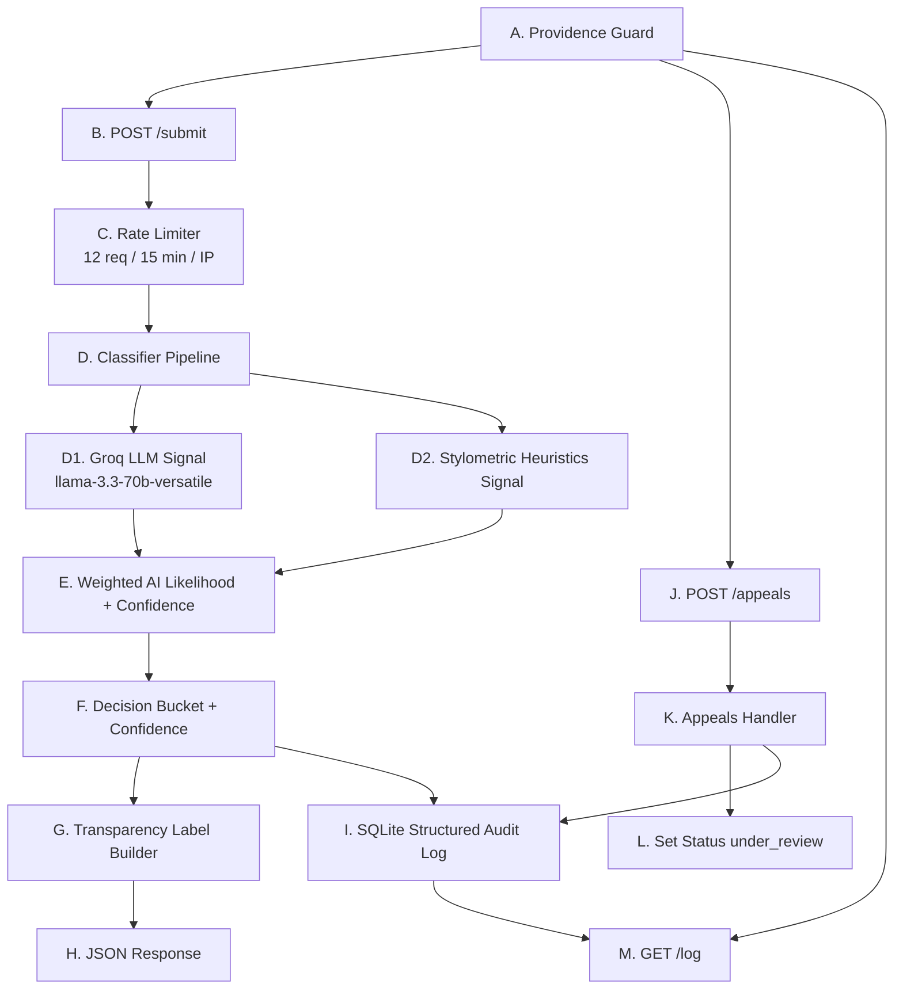

# Provenance Guard Planning

## Problem Statement
Creative platforms where people share original work — writing, music, and art, for example — are facing a new challenge: how do you know whether what someone posted was made by them, or generated by AI and passed off as human? A fair, transparent way to estimate whether submitted text is AI-generated or human-written is needed, while giving creators the ability to appeal a decision when the estimate is disputed.

## Scope
- Build a text attribution API.
- Use a multi-signal pipeline.
- Return confidence and user-facing transparency label.
- Capture immutable audit events.
- Support appeals that move content to under_review.
- Add submission rate limiting.

## Implementation Stack
- Python 3 with Flask for REST endpoints.
- Flask-Limiter for submission rate limiting.
- Groq API (`llama-3.3-70b-versatile`) as semantic attribution signal.
- Pure Python stylometric heuristics as second attribution signal.
- SQLite (`sqlite3`) for content, decisions, appeals, and audit events.

## Signal Design
### 1. Groq semantic attribution signal:
  - Prompts `llama-3.3-70b-versatile` to return `ai_likelihood` in `[0,1]`.
  - In that score:
    - 0 means very likely human-written.
    - 1 means very likely AI-generated.
    - Values in between represent uncertainty on a continuous scale.
  - Rationale: language model can evaluate context-level indicators not captured by simple heuristics.
### 2. Stylometric heuristics signal:
  - Combines lexical diversity risk and sentence burstiness risk.
    - **Lexical diversity risk** : 
      - Measures how repetitive the vocabulary is.
      - If a text reuses the same words a lot, diversity is low, so risk goes up.
      - If a text uses a wider variety of words, diversity is high, so risk goes down.
  - Rationale: generated text often has lower lexical variation and flatter sentence rhythm.
   - **Sentence burstiness risk**
      - Measures how much sentence lengths vary.
      - Human writing often has a mix of short and long sentences (more bursty).
      - Very uniform sentence lengths can look more machine-like, so risk goes up.
  - **“Combines … risk” means:**
      - You compute both risks on a 0 to 1 scale.
      - Then you take a weighted average to form one stylometric AI-likelihood component.

I chose the stylometric weights as 0.55 for lexical diversity risk and 0.45 for sentence burstiness risk because lexical diversity is usually a slightly more stable indicator across short and medium-length texts, while burstiness is valuable but more sensitive to genre and formatting. The near-balanced split keeps both signals influential, avoids over-reliance on a single heuristic, and supports a conservative scoring design that reduces overconfident false-positive AI labels.

### 3. Ensemble weighting:
  - Groq signal weight: 0.65
  - Stylometric signal weight: 0.35
  - If Groq is unavailable, fallback forces conservative `uncertain` decision.

I weighted Groq at 0.65 and stylometric heuristics at 0.35 because they play different roles in reliability and coverage:

### Groq signal (0.65) gets majority weight
  - It captures semantic and discourse-level cues that simple surface metrics cannot.
  - It can evaluate broader context, tone consistency, and high-level structure in a single pass.
  - In practice, this makes it the stronger primary signal when available.
Stylometric signal (0.35) remains substantial
It is deterministic, local, and cheap to compute.
It provides an independent cross-check against model output.
It can still contribute meaningfully, especially when Groq is borderline.

## Confidence and Decision Rules
- Compute weighted AI likelihood from the 2 signals.
- Apply calibration that biases toward avoiding false positive AI claims.
- Final decision buckets:
  - likely_ai when aiLikelihood >= 0.86 and confidence is strong
  - likely_human when aiLikelihood <= 0.30 and confidence is strong
  - uncertain otherwise
- Confidence is reported as confidence in the assigned bucket.

## Appeals Workflow
- Creator submits reasoning tied to a contentId.
- Appeal is persisted and linked to the latest decision.
- Content and decision status change to under_review.
- Appeal action is appended to structured audit log.

## Rate Limit Plan
- Protect POST /submit with 12 submissions per IP per 15 minutes.
- Reasoning:
  - Normal creators rarely need more than a dozen attribution checks in 15 minutes.
  - This slows brute-force probing and flood attempts while preserving legitimate use.

## Audit Log Plan
- Log classification and appeal events in SQLite with:
  - event type
  - ids (content, decision, appeal)
  - timestamp
  - structured payload (signals, confidence, result, label text, appeal reason)

## API Surface
### 1. **POST/submit** -> →signal 1 → signal 2 → confidence scoring → transparency label → audit log → response   
### 2. **POST/appeal** -> status update → audit log → response
### 3. **GET/log** 

## Architecture

------------------------------------------------------------------------------
I tried to update the arrows on Mermaid, but was ultimately unsuccessful in doing so. 

### What Data Gets Sent: 
  **A[A. Providence Guard] --> B[B. POST /submit]**: {creatorId: creator-42, content: text to analyze}
  **B[B. POST /submit] --> C[C. Rate Limiter\n12 req / 15 min / IP]**: Client identity key (typically IP address), Route key (POST /submit), Current timestamp/request count context 
**C[C. Rate Limiter] --> D[D. Classifier Pipeline]**: Sends one of two outcomes: 1. Allowed request(passes through) or 2. Returns Blocked request - 429 Too Many Requests"
**D[D. Classifier Pipeline]: --> D1[D1. Groq LLM Signal\nllama-3.3-70b-versatile]**:
The submitted content text. A system instruction to score conservatively (to reduce false-positive AI accusations). A user instruction asking for JSON output with: ai_likelihood in the range [0,1], rationale text
**D[D. Classifier Pipeline] --> D2[D2. Stylometric Heuristics Signal]**: same information that was sent to D1 Groq LLM signal
**D1[D1. Groq LLM Signal\nllama-3.3-70b-versatile] --> E[E. Weighted AI Likelihood + Confidence]**: ai_likelihood (0 = likely human, 1 = likely AI), rationale (brief explanation), availability/error fallback data if the call fails 
**D2[D2. Stylometric Heuristics Signal] --> E[E. Weighted AI Likelihood + Confidence]**: Combined stylometric AI-likelihood score in ([0,1]) based on lexical diversity risk and sentence burstiness risk.
  **E[E. Weighted AI Likelihood + Confidence] --> F[F. "Decision Bucket + Confidence"]**: 
  1. aiLikelihood (0 to 1)
  2. Combined score after weighting Groq + stylometric signals.
  **F[F. "Decision Bucket + Confidence"] --> G[G. Transparency Label Builder]**: Uses those two values to assign likely_ai, likely_human, or uncertain and sends to Transparency Label Builder.
  **G[G. Transparency Label Builder] --> H[H. JSON Response]** : transparencyLabel (human-readable sentence with confidence percent filled in)
**F[F. "Decision Bucket + Confidence"] --> I[I. SQLite Structured Audit Log]**: full auditable classification event written to SQLite: 1. Decision Outcome: result (likely_ai, likely_human, or uncertain), confidence, ai_likelihood, 2. Content Identifieers: contentId, decisionId, timestamp/event type 3. Evidence and output: signals used, labelText (transparencyLabel)
**A[A. Providence Guard] to J[J. POST/appeals]**:  payload {"contentId": "20d2d201-e5ba-4eec-9ca1-712e6330180e", "creatorId":  "creator-1", "reasoning": "This draft came from my notebook revisions and timestamped edits."}
**J[J. POST/appeals] to K[K. Appeals Handler]**: sends valdated appeal payload to Appeals Handler. Payload is the same as A to J. payload {"contentId": "20d2d201-e5ba-4eec-9ca1-712e6330180e", "creatorId":  "creator-1", "reasoning": "This draft came from my notebook revisions and timestamped edits."}
*** K[K. Appeals Handler] --> L[L. Set Status under_review]***: K sends a status change instruction to L. 1. Target record IDs (contentId, and decisionId if present), 2. new status value: under_review, 3. update timestamp/context for persistence and audit.
*** K[K. Appeals Handler] --> I[I. SQLite Structured Audit Log]***:K (Appeals Handler) sends an appeal audit event to I (SQLite Structured Audit Log). K (Appeals Handler) sends an appeal audit event to I(SQLite Structured Audit Log). It logs: 1. eventType: appeal_submitted, 2. IDs: contentId, decisionId (if available), appealId, 3. timestamp,
4. payload fields such as: creatorId, reasoning, updatedContentStatus = under_review
**A[A. Providence Guard] --> M[M. GET/log]**: A sends a read request to M, including an HTTP GET/log, no JSON body, for the purpose of asking the system the structured audit history. See audit payload in next entry. 
**I[I. SQLite Structured Audit Log] --> M[M. GET/log response handler]**: Audit Payload: eventType: classification_decision, contentId, decisionId, timestamp,  Decision Outputs: result (likely_ai, likely_human, uncertain), confidence, Signal Evidence: Groq signal, stylometric signal, and weights, Transparence Label: label text"

## Implementation Checklist

### 1. app.py
- Define routes: GET /health, POST /submit, POST /appeals, GET /log, optional GET /content/<content_id>.
- Add input validation for submit/appeal payloads.
- Wire rate limiter onto POST /submit.
- Return structured JSON responses and status codes (201, 400, 404, 429).

### 2. config.py
- Load .env values (PORT, RATE_LIMIT_SUBMIT, GROQ_API_KEY, GROQ_MODEL, GROQ_API_URL, SQLITE_DB_PATH).
- Provide safe defaults when env vars are missing.
- Keep config constants centralized (no hardcoded values in route logic).

## 3. groq_client.py
- Build Groq request wrapper for llama-3.3-70b-versatile.
- Prompt model to return JSON with ai_likelihood and rationale.
- Parse response robustly and clamp likelihood to [0,1].
- Add graceful fallback output when API key/network/model fails.

## 4. classifier.py
- Implement stylometric calculations:
    - lexical diversity risk
    - sentence burstiness risk
    - stylometric weighted score (0.55/0.45)
- Combine Groq + stylometric scores (0.65/0.35).
- Compute confidence score.
- Map to decision bucket:
    - likely_ai
    - likely_human
    - uncertain
- Return complete signal object for auditability.

## 5. labels.py
- Store exact 3 label templates (AI, human, uncertain).
- Implement build_transparency_label(result, confidence).
- Convert confidence to rounded percent for label text.

## 6. audit_store.py
- Initialize SQLite schema:
    - contents
    - decisions
    - appeals
    - audit_events
- Implement helpers:
    - create content record
    - save decision
    - save appeal
    - fetch log entries
- Ensure every decision and appeal writes structured audit event rows.

## 7. requirements.txt
- Ensure required packages are present:
    - flask
    - flask-limiter
    - groq
    - python-dotenv

## 8. .env and .gitignore
- .env: set config keys (no secrets committed).
- .gitignore: ensure .env, *.db, .venv, __pycache__ are ignored.

## 9. README.md
- Confirm endpoint documentation matches implementation.
- Include exact transparency label text variants.
- Document chosen rate limits and reasoning.
- Include sample GET /log output with 3+ entries.
- Add quick-start run commands for Python. 

## 10. planning.md
- Keep architecture diagram synced to real code flow.
- Keep signal rationale and weights consistent with classifier logic.

## 11. Final validation pass (manual)
- Start app.
- Run:
    - 2 x POST /submit
    - 1 x POST /appeals
    - 1 x GET /log
- Confirm:
    - labels render correctly
    - appeal sets under_review
    - log has structured entries for decisions + appeal