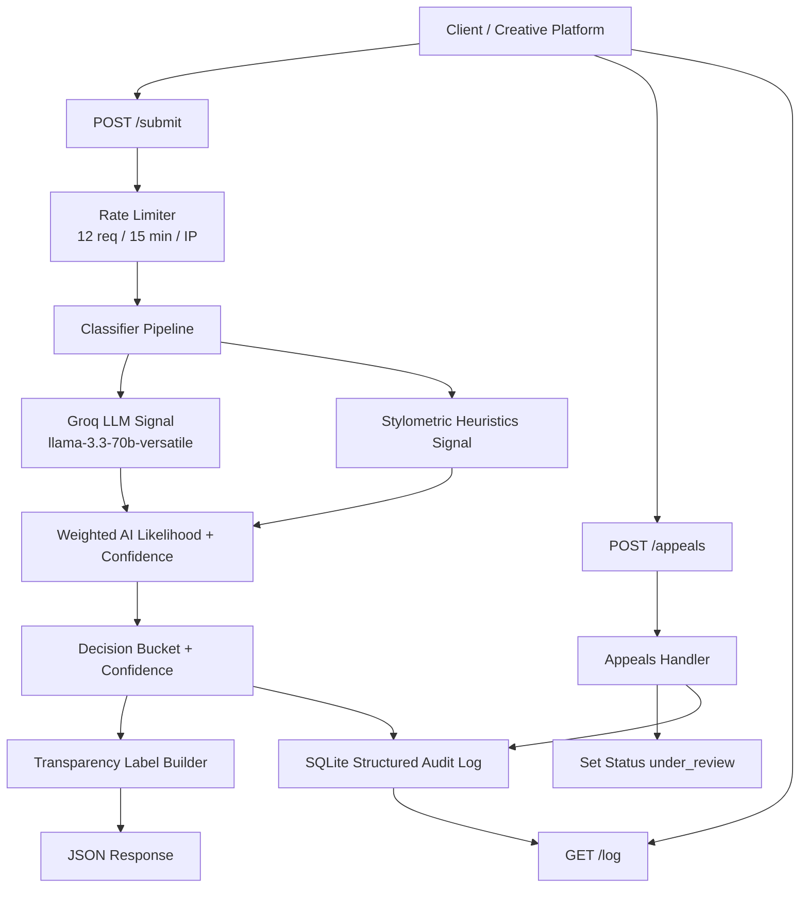

# Provenance Guard Planning

## Problem Statement
Creative platforms need a fair, transparent way to estimate whether submitted text is AI-generated or human-written while giving creators due process when the estimate is disputed.

## Scope
- Build a text attribution API.
- Use a multi-signal pipeline.
- Return confidence and user-facing transparency label.
- Capture immutable audit events.
- Support appeals that move content to under_review.
- Add submission rate limiting.

## Implementation Stack
- Python 3 with Flask for REST endpoints.
- Flask-Limiter for submission rate limiting.
- Groq API (`llama-3.3-70b-versatile`) as semantic attribution signal.
- Pure Python stylometric heuristics as second attribution signal.
- SQLite (`sqlite3`) for content, decisions, appeals, and audit events.

## Signal Design
1. Groq semantic attribution signal:
  - Prompts `llama-3.3-70b-versatile` to return `ai_likelihood` in `[0,1]`.
  - Rationale: language model can evaluate context-level indicators not captured by simple heuristics.
2. Stylometric heuristics signal:
  - Combines lexical diversity risk and sentence burstiness risk.
  - Rationale: generated text often has lower lexical variation and flatter sentence rhythm.
3. Ensemble weighting:
  - Groq signal weight: 0.65
  - Stylometric signal weight: 0.35
  - If Groq is unavailable, fallback forces conservative `uncertain` decision.

## Confidence and Decision Rules
- Compute weighted AI likelihood from the 2 signals.
- Apply calibration that biases toward avoiding false positive AI claims.
- Final decision buckets:
  - likely_ai when aiLikelihood >= 0.86 and confidence is strong
  - likely_human when aiLikelihood <= 0.30 and confidence is strong
  - uncertain otherwise
- Confidence is reported as confidence in the assigned bucket.

## Appeals Workflow
- Creator submits reasoning tied to a contentId.
- Appeal is persisted and linked to the latest decision.
- Content and decision status change to under_review.
- Appeal action is appended to structured audit log.

## Rate Limit Plan
- Protect POST /submit with 12 submissions per IP per 15 minutes.
- Reasoning:
  - Normal creators rarely need more than a dozen attribution checks in 15 minutes.
  - This slows brute-force probing and flood attempts while preserving legitimate use.

## Audit Log Plan
- Log classification and appeal events in SQLite with:
  - event type
  - ids (content, decision, appeal)
  - timestamp
  - structured payload (signals, confidence, result, label text, appeal reason)

## Architecture

